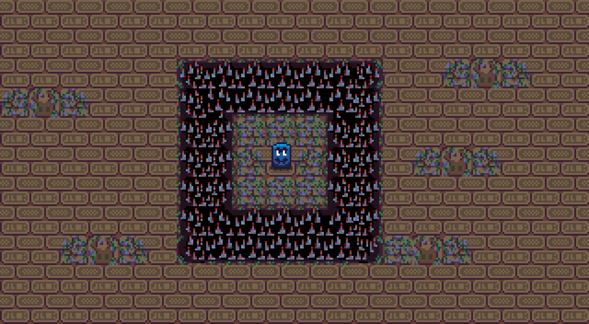

# SwitchBot 2: The Dangers of the Tomb

This game is a pixel art 2D thing developed for the [RoastMeJam](https://itch.io/jam/roastmejam) hosted by PinoPrime.

This is a "sequel" of the one of the previous creator's game ["SwitchBot" created for the Wowie Jam 4.0 GameJam](https://sonicmam.itch.io/switchbot).

The goal of the inital game was leading big block enemies through a hidden temple filled with traps. Your mission is to guide the block enemies over switches scattered throughout each level, which will activate crawlspaces that lead to the next challenge.

Language: GDScipt

Renderer: idk lol

## Screenshots

